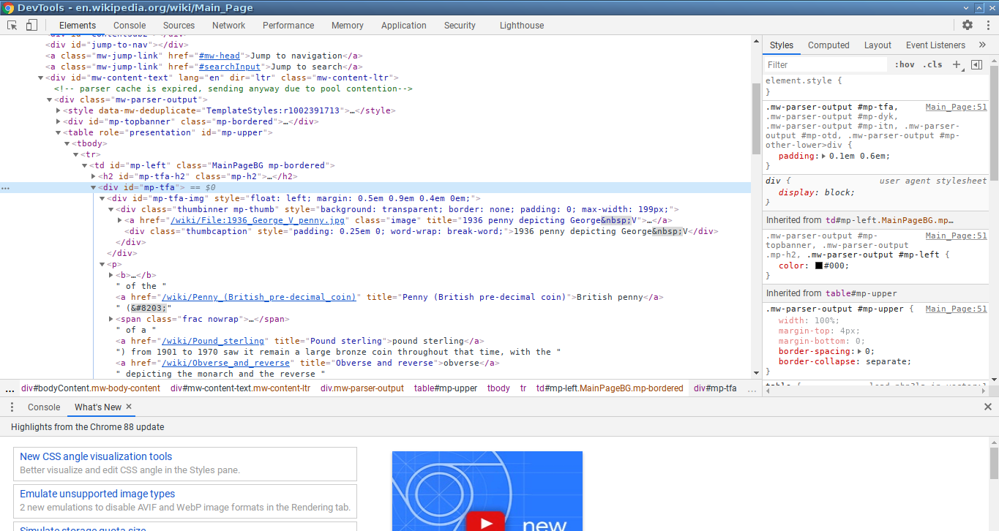
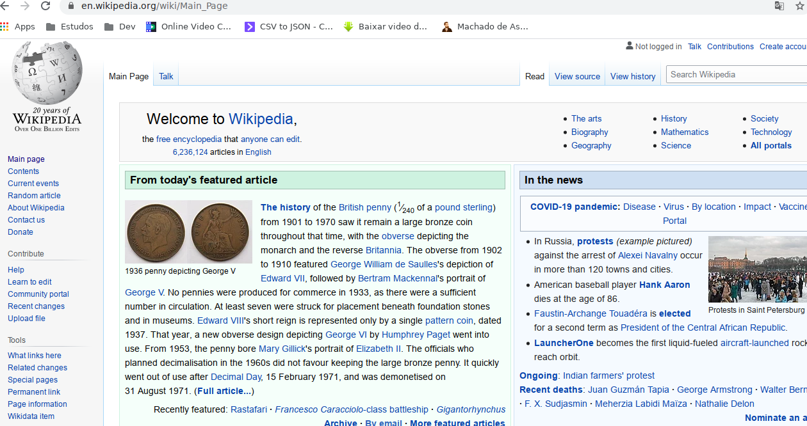

# Urllib Web open

Access web using python script e download page.
### Requeriments:

- BeautifulSoup 
- Urllib (Python module default)

### Info

- [BeautifulSOup Documentation](https://www.crummy.com/software/BeautifulSoup/bs4/doc/)
- [Python 3.x Doc Urllib](https://docs.python.org/3/library/urllib.html)

[Youtube video](https://www.youtube.com/watch?v=Zqm_GB9aTL4)
